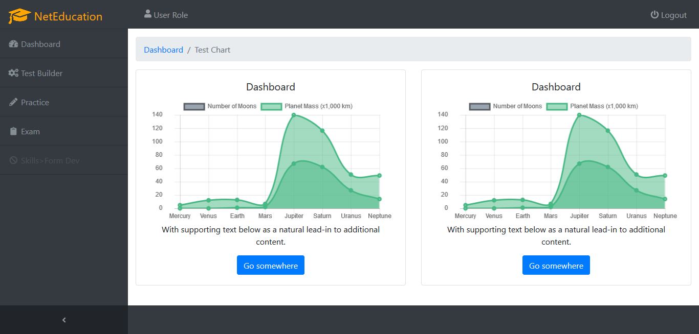

# Net Education

CMS for educational test and record
-

> Dependencies after [VueJS Webpack](http://vuejs-templates.github.io/webpack/) template
- bootstrap (jQuery, popper.js)
- node-sass
- sass-loader
- fontawesome [[⇗]](https://github.com/maoberlehner/node-sass-magic-importer/tree/master/packages/node-sass-magic-importer)
- ~~d2bJS~~
- chart.js
- startbootstrap-sb-admin (using Font Awesome 4.7.0) [[⇗]](https://github.com/BlackrockDigital/startbootstrap-sb-admin)
- vuex

### Sample:

