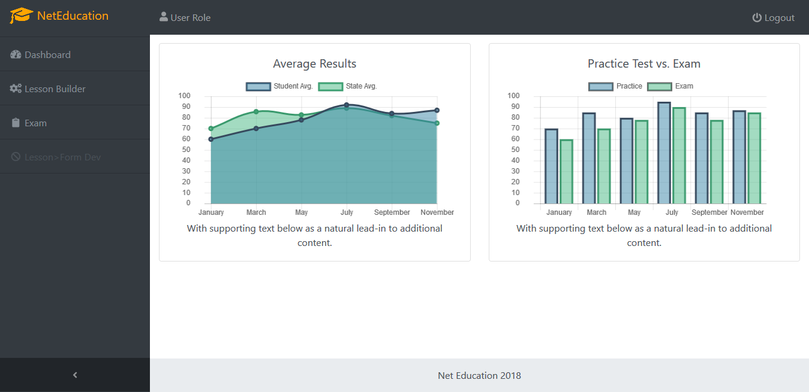

# Net Education

CMS for educational test and record
-

> Dependencies after [VueJS Webpack](http://vuejs-templates.github.io/webpack/) template
- bootstrap (jQuery, popper.js)
- node-sass
- sass-loader
- fontawesome [[竍余](https://fontawesome.com/icons?d=gallery&s=solid&m=free)
- ~~d2bJS~~
- chart.js [[竍余](https://www.chartjs.org/)
- startbootstrap-sb-admin [[竍余](https://github.com/BlackrockDigital/startbootstrap-sb-admin)
- vuex
- simple-vue-validator [[竍余](http://simple-vue-validator.maijin.info/#installation)
- Google Firebase

### Sample:

